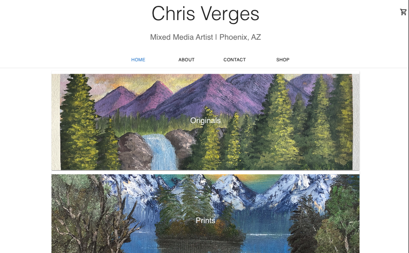
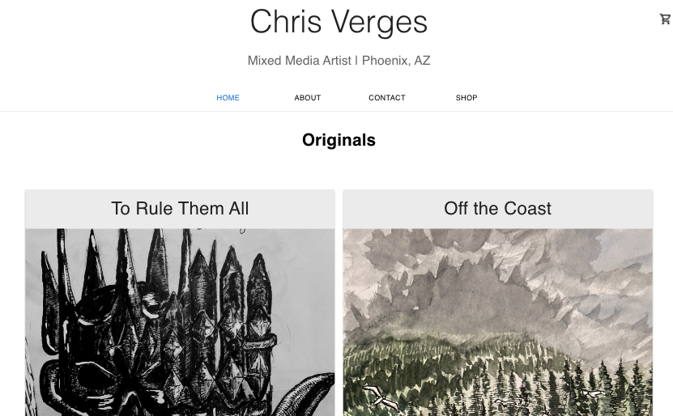
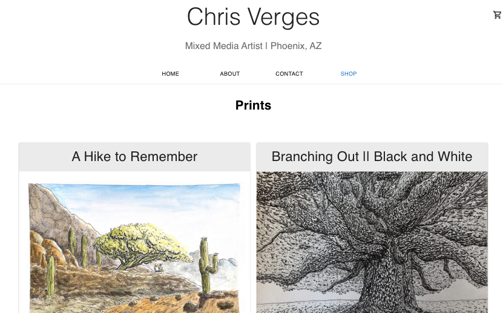
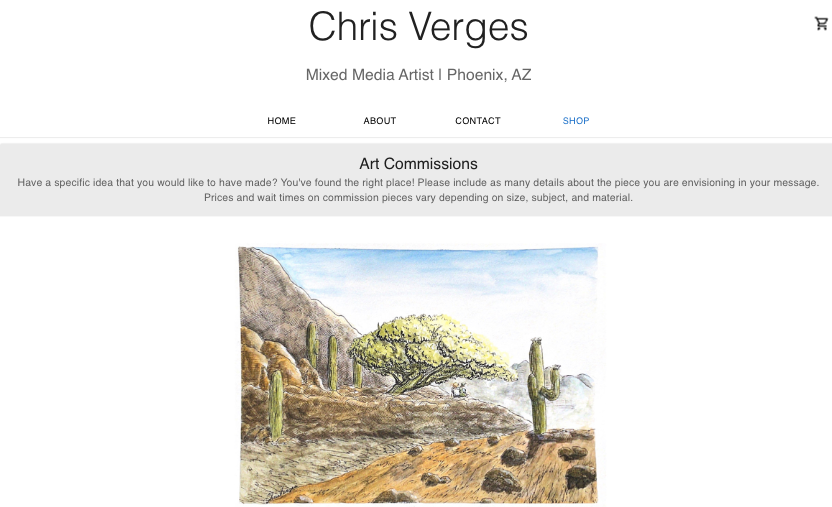
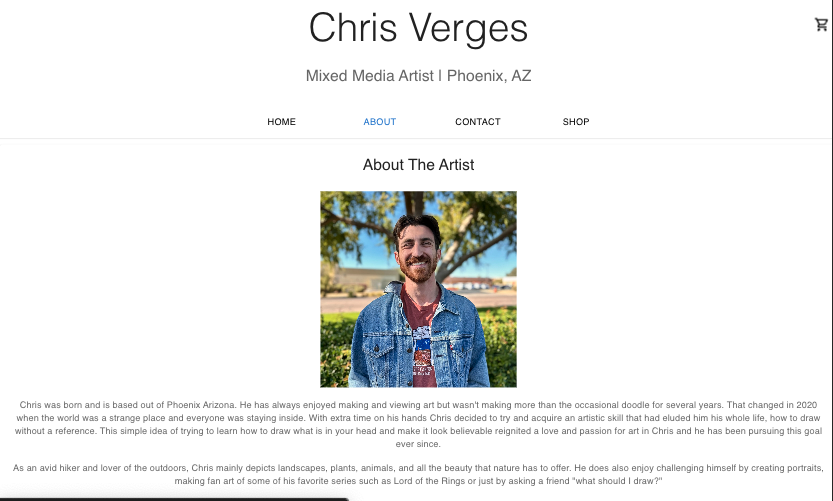
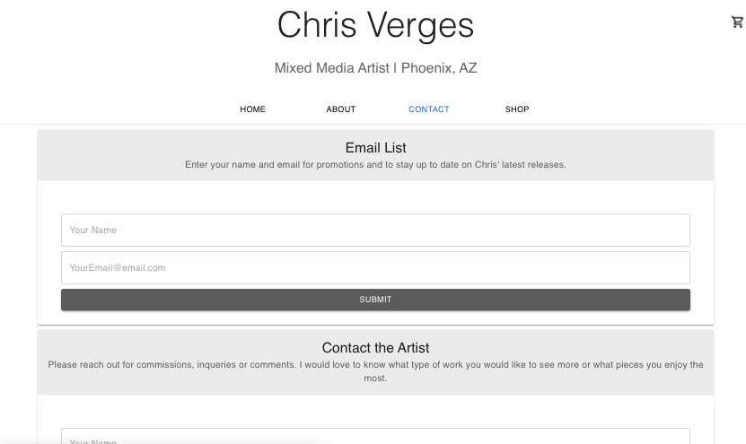

# Personal Art Store

## Licensing: MIT 

## Description

As a web developer with a passion for making art I wanted to make a prototype art store for myself. This project is designed to push my developement skills by building a fully functioning e-commerce site. I also wanted to create it so that if I ever decided to sell my art I would have a site ready to go. I am already expanding my knowledge of React, GraphQL and front-end frameworks such as MUI while working on this project. I have also needed to think outside the box in order to solve problems I never encountered while programming in the class room.

The Production verison of this application can be found at https://chrisvergesart-a007f39ad1a3.herokuapp.com/

## Table of Contents

-[Installation](#installation) -[Usage](#usage) -[Credits](#credits) -[License](#license)

## Website Screenshots

## Installation

To install this project download the starter code from https://github.com/cverges1/art-store/tree/main. Once complete, run `npm i` to install all necessary dependencies and finally `npm run seed` to add all data to the database.

## Usage

Visit https://chrisvergesart-a007f39ad1a3.herokuapp.com/ and explore this example e-commerce site for an up and coming artist. Explore different pages, categories and add products to the cart to see how the site would work.

At this time checkout only works in development as art is still a fun hobby and am not quite ready to start selling. To see how it would work, please follow the steps to [Install](#installation) and use a test [card number](https://stripe.com/docs/testing?testing-method=card-numbers#visa).

## Credits

- Collaborators: Nick Verges (Github: [nverges](https://github.com/nverges)) has provided helpful insight and advice during the development of this app.
- Third Party Assets: React.js, Node.js, Express.js, MUI, Stripe, concurrently, GraphQL, MongoDB, bcrypt

## Questions

To contact me with additional questions:

- Github: cverges1
- Email: vergeschris@gmail.com
